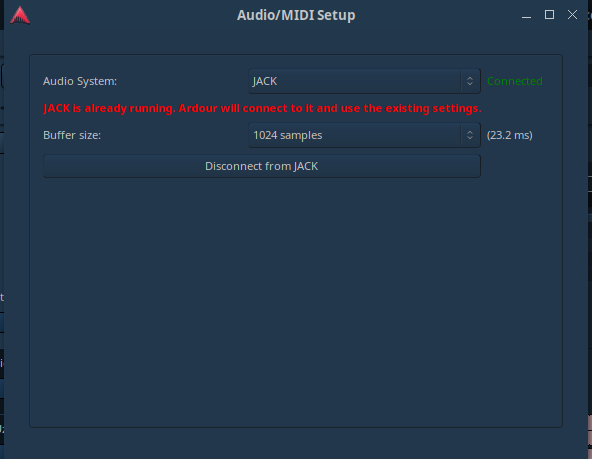

# Menjalanakan Ardour sebagai client dari JACK

## Alat dan Bahan

1. Ardour
2. QjackCtl

## Pelaksanaan

1. Nyalakan [JACK dengan Pulseaudio](Jack_pulse.md)
2. Buka Ardour lalu cari session yang memiliki Sample rate yang sama dengan JACK server
3. Jika tidak ada yang sama, maka buat session baru
4. Maka otomatis Ardour akan menjadi client dari JACK, bisa dicek dengan QjackCtl-graph  
   
5. Jika masih belum ada client bernama Ardour, berarti Ardour belum konek, Silahkan pergi ke window pada Ardour (diatas) lalu pilih 'Aduio/MIDI setup', lalu ganti audio system ke 'JACK'  
   
