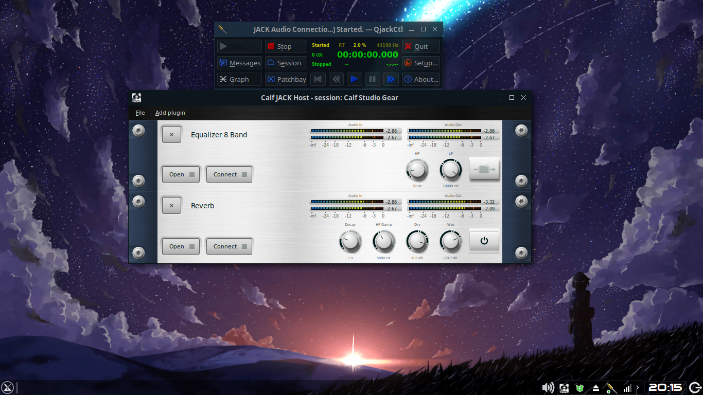
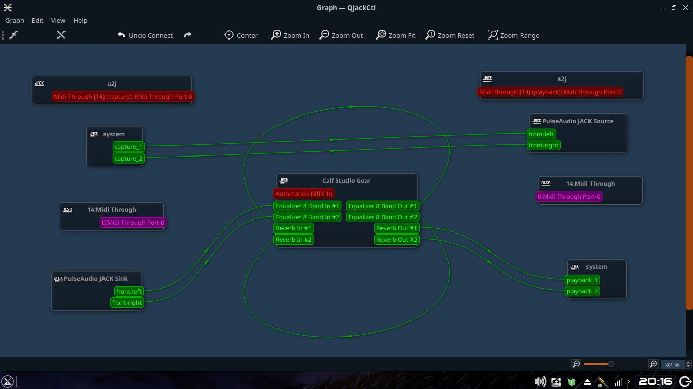
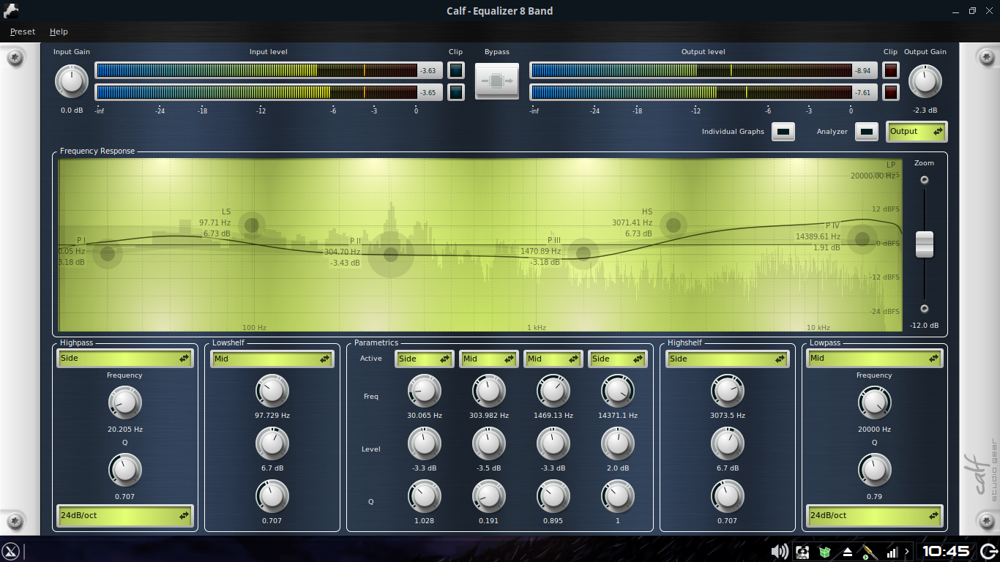
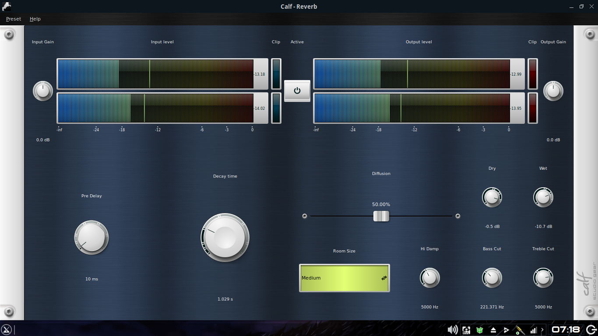
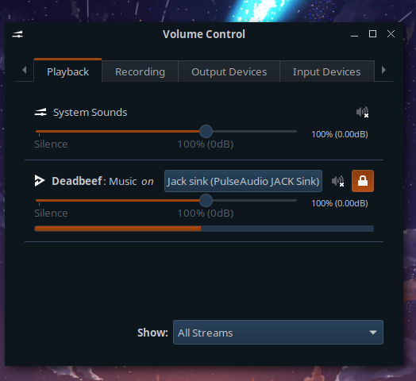

# Menggunakan efek tambahan untuk mendengarkan Musik

## Alat dan Bahan

1. QjackCtl
2. Calf plugin pack for JACK
3. Firefox atau yang lainnya (sebagai pemutar musik)

## Pelaksanaan

1. Hidupkan [JACK dengan Pulseaudio](Jack_pulse.md)
2. Buka Calf plugin pack
3. Pilih add plugin. Sebagai contoh saya gunakan 2 plugin yaitu Eq dengan Reverb  
   
4. Sehingga Routing menjadi  
   
5. Anda bisa konfigurasi sesuka hati. saran saya untuk masalah routing, bisa dilakukan pada QjackCtl-graph agar lebih mudah

## Contoh konfigurasi Efek

- 8-band Equalizer  
  
- Reverb
  

## Debugging

- Suara tidak keluar dari Pulseaudio JACK sink? -> buka Pavucontrol (Pulseaudio volume control) lalu pilih pada bagian playback, set playback ke pulseaudio JACK sink. atau bisa di-set untuk defaultnya `pactl set-default-sink jack_out`  
  
- Routing sudah sampai system playback namun suara tidak keluar? -> periksa lagi input dan output [JACK server](QjackCtl1.md)
