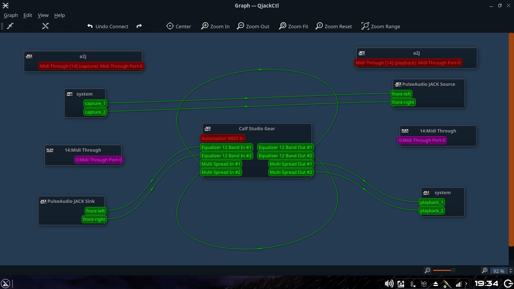

# JACK

JACK adalah sebuah aplikasi atau package yang banyak digunakan oleh Audiophile. JACK punya beberapa Interface seperti Cadence, Carla, dan QjackCtl. Pada pembahasan kali ini saya akan membahas tentang QjackCtl.

# QjackCtl

QjackCtl adalah sebuah aplikasi interface dari JACK yang dibuat dengan framework QT.
Penggunaannya pun cukup mudah. QjackCtl banyak digunakan untuk melakukan Routing Internal pada komputer atau laptop. Berikut adalah penampakan dari QjackCtl  

1. [QjackCtl konfigurasi awal](QjackCtl1.md)
2. [QjackCtl dengan pulseaudio](Jack_pulse.md)
3. [QjackCtl routing antar aplikasi](Route_multi_app.md)
4. [QjackCtl Tuning latency](Tuning_latency.md)
