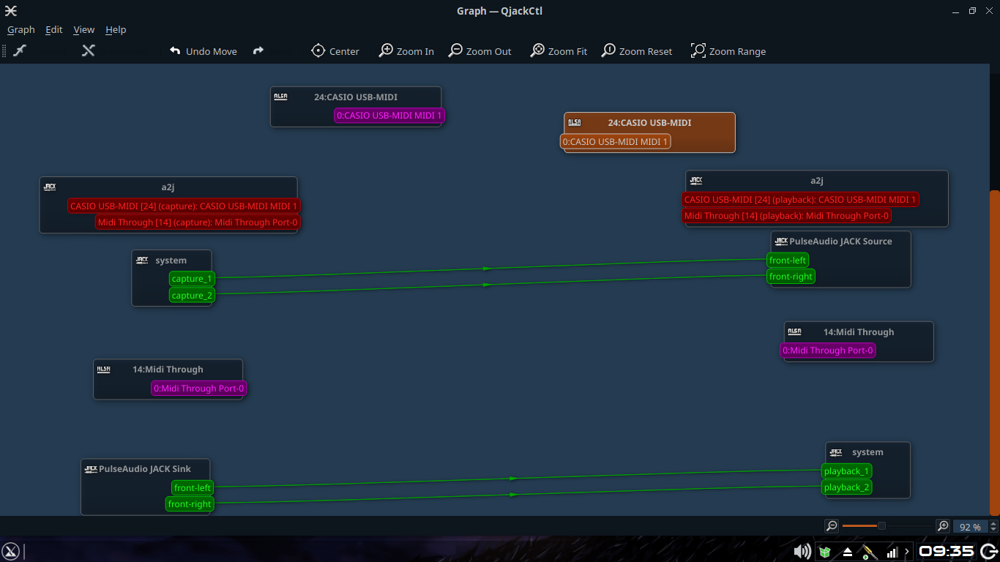

# JACK dengan Pulseaudio

## Alat dan Bahan

1. Pulseaudio
2. QjackCtl
3. Module jack untuk Pulseaudio
4. Sebuah Aplikasi yang mengeluarkan suara untuk testing

`*nb jika anda memakai AV Linux MX Edition, semua sudah tersedia tinggal menambahkan modul jack untuk Pulseaudio`

## Pelaksanaan

1. Instal module jack untuk Pulseaudio

```
sudo apt install pulseaudio-module-jack
```

2. Matikan proses Pulseaudio

```
killall pulseaudio
```

2. Buka [server JACK](QjackCtl1.md)
3. Tambahkan pulseaudio sebagi client dari JACK

```
pactl load-module module-jack-sink
pactl load-module module-jack-source
```

4. Hubungkan melalui QjackCtl-graph. Contoh:  
   
5. Seharusnya sudah sukses. Untuk memastikannya, coba play lagu dari Youtube, atau apapun itu. Youtube -> Pulseaudio -> Pulseaudio JACK Sink -> System playback

## Sedikit penjelasan

- System capture adalah Hasil input dari ALSA (Dikonfigurasi oleh JACK server)
- System playback adalah interface dari output soundcard. Semua yang di-route kesini pasti akan keluar suaranya (Sesuai konfigurasi soundcard dari JACK server)
- Pulseaudio JACK Source adalah port untuk memasukkan suara ke Pulseaudio
- Pulseaudio JACK Sink adalah port keluaran suara dari Pulseaudio
- Untuk mengatur settingan default dari pulseaudio bisa diedit di `/etc/pulse/default.pa`

## Debugging

- Sound masuk pulseaudio tapi tidak keluar dari pulseaudio JACK sink? -> Konfigurasi Pulseaudio. CLI -> `pactl set-default-sink jack_out`. GUI -> Buka volume control -> pada bagian playback, ganti playback ke pulseaudio JACK Sink.
- Tidak ada module JACK pada pulseaudio? -> `sudo apt install pulseaudio-module-jack`
- Sudah ter-instal tapi masih belum ada? -> lakukan step 3 lalu cek dengan `pactl list modules | grep jack` -> seharusnya akan keluar output, jika belum keluar berarti pulseaudio-module-jack masih belum terinstal.
- Sound masuk ke System playback namun tidak keluar suara? -> Konfigurasi soundcard untuk input output pada [JACK server](QjackCtl1.md).
- Masih error? -> ulangi lagi dan cari di google untuk solusinya
