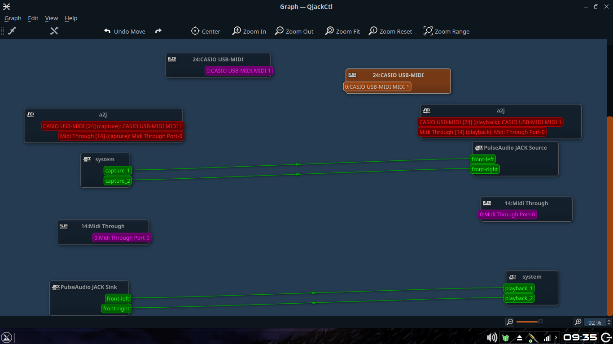
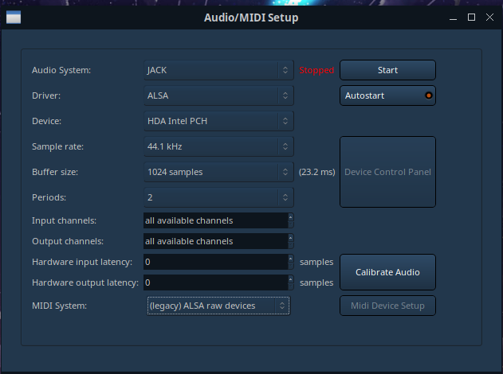

# Penggunaan MIDI keyboard dengan AV Linux

## Alat dan Bahan

1. Keyboard CTK-7000 sebagai MIDI Controller (Terserah mau pake apa)
2. Kabel MIDI atau kabel Printer sebagai penguhung Keyboard dengan Komputer
3. JACK sebagai Sound server
4. Pulseaudio sebagai client dari JACK
5. Ardour sebagai client dari JACK sekaligus interface dari MIDI Controller
6. ALSA sebagai Sound driver

## Pelaksanaan

1. Siapkan Alat dan Bahan
2. Sambungkan Keyboard dengan Komputer menggunakan (port USB ke Komputer) pastikan sudah terhubung, untuk mengetahuinya silahkan gunakan command `lsusb`  
   
3. Jalankan [server JACK dengan pulseaudio](Jack_pulse.md)  
   
4. Jalankan [Ardour dengan JACK](Ardour_jack.md)  
   
5. Buat satu MIDI Track
6. Kembali ke QjackCtl lalu masuk ke 'graph' lalu sambungkan MIDI Capture dengan MIDI Track yang telah kita buat tadi (Warnanya merah) (Cara 1)  
   
7. Klik kiri pada MIDI Track lalu setelah ter-klik, silahkan klik kanan lalu pilih bagian input, lalu sambungkan dengan cara klik kiri (Ada lingkaran warna hijau -> tersambung) (Cara 2)
8. Klik tulisan 'window' (Ada di atas), lalu pilih ke MIDI Connection, lalu sambungkan dari sana (Cara 3)
9. Seharusnya suara sudah terdengar, jika belum terdengar silahkan debugging cek routing apakah sudah benar
10. Untuk mengatur suara, silahkan pergi ke mixer (Alt+m) lalu double klik pada plugin General MIDI Keyboard lalu tinggal ganti suara pada C1 atau Anda juga bisa memakai suara dari keyboard anda  
    
11. Selamat menikmati... Salam pemusik dari Jember

## Debugging

- Tidak keluar suara? -> cek koneksi dari mulai sumber suara yaitu MIDI Controller

`*nb MIDI Controller -> Ardour MIDI track in -> Ardour Master in -> System playback`
