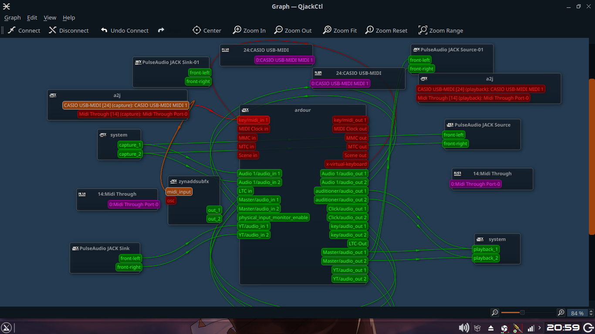

# Bermain menggunakan MIDI Keyboard dan lagu dari Youtube

## Sedikit penjelasan

Sebenarnya bukan hanya dari Youtube, bisa dari apapun..

## Hasil

Silahkan lihat [disini](https://youtu.be/3adRNnnQJgw)

## Pelaksanaan

1. Siapkan [MIDI dengan keyboard](MIDI1.md)
2. Siapkan Youtube
3. Routing Youtube ke Ardour (Agar bisa di-record dan di-mixer dengan mudah) | Tutorial? -> [disini](Route_multi_app.md)  
   
4. Ganti instrument MIDI anda (terserah mau pake apa), saya pake Odin2

```
*di_Ardour -> Pergi ke mixer (Alt+m)
*di_Ardour -> pilih track MIDI
*di_Ardour -> klik kanan
*di_Ardour -> pilih 'by tag'
*di_Ardour -> pilih 'instrument'
Silahkan pilh Instrument yang anda inginkan
```

5. Untuk rekording, gunakan [OBS](OBS1.md)

`*nb saya menggunakan ZynAddSubFx hanya untuk menampilkan permainan keyboard saya (Karena males kalo pake kamera wkkwkwkwk)`
