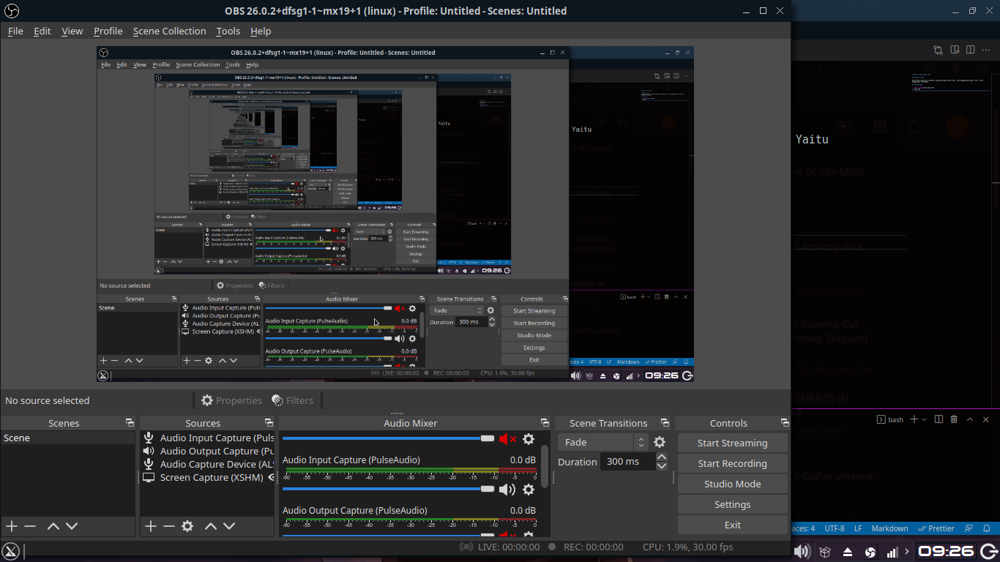

# Record Video dengan OBS

## Sedikit cerita

Karena OBS tidak bisa integrasi langusng dengan JACK server, maka penggunaanya agak tricky. Yaitu menggunakan PulseAudio.

## Pelaksanaan

1. [Start JACK](Jack_pulse.md)
2. Buka OBS
3. Pada bagian Source , pilih add lalu tambahkan `Audio Input Capture (PulseAudio)`  
   
4. Pergi ke QjackCtl lalu buka graph
5. Route semua output dari aplikasi yang ingin anda rekam ke Pulseaudio JACK Source, Sebagai contoh saya menggunakan Ardour  
     
   Dapat dilihat bahwa output dari Master pada Ardour mengarah kepada `PulseAudio JACK source` (untuk record OBS) dan `System playback` (untuk saya mendengarkan suaranya)
6. Silahkan cek, harusnya sudah berhasil

## Sedikit tambahan cerita

- Kenapa Pulseaudio JACK saya ada 2? -> Karena waktu itu saya sedang mencoba-coba dan lagi malas untuk menghapus yang satunya wkwkwkwk
- Pulseaudio JACK hanya 1 apakah bisa? -> Bisa
- PulseAudio JACK saya ada 2, dan ingin menghapus satunya -> cek dulu id dengan `pactl list modules` lalu hapus dengan `pactl unload-module [id]` contoh `pactl unload-module 30`
