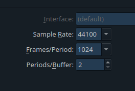
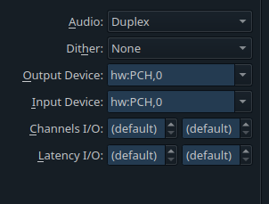
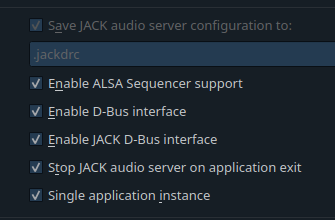

# Memulai JACK sound server dengan interface QjackCTL

## Alat dan Bahan

1. QjackCtl

## Pelaksanaan

1. Buka QjackCtl
2. Masuk ke bagian setup
3. Untuk drivernya saya sarankan untuk memilih ALSA
4. Tuning untuk latency  
   
5. Setting input output sesuai kebutuhan (Biasanya pilih PCH)  
   
6. Apply lalu start QjackCtl

## Debugging

- Error Xrun notif message selalu berjalan? (warna merah) -> Kemungkinan latency yang tidak pas dengan soundcard, bisa dituning lagi.
- Error tidak bisa memulai server? -> `killall pulseaudio` sampai tidak ada proses, lalu start QjackCtl
- Error tidak bisa memulai server? -> Bisa juga karena berusaha mengakses card input output yang tidak tersedia. Coba ganti card untuk input outputnya. Bisa dicek dengan `arecord -l` dan `aplay -l` dengan format **hw:card,device**
- Error tidak bisa memulai server? -> Coba gunakan setting ini  
  
