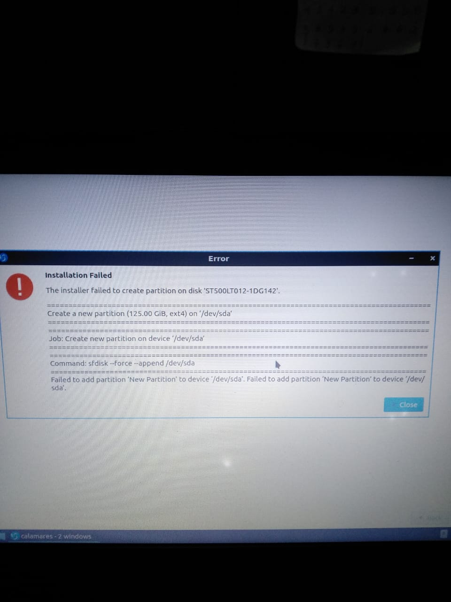

# Failed to add new partition



## Sedikit cerita

Saya mengalami hal tersebut saat melakukan Instalasi Lubuntu20.04 amd64 (64-bit) yaitu pada proses mengubah partisi Unallocated menjadi primary partisi (ext4)

## Solusi

Buat partisinya menggunakan gparted yang dijalankan pada Bootable linux

```
sudo apt install gparted
sudo gparted
```
