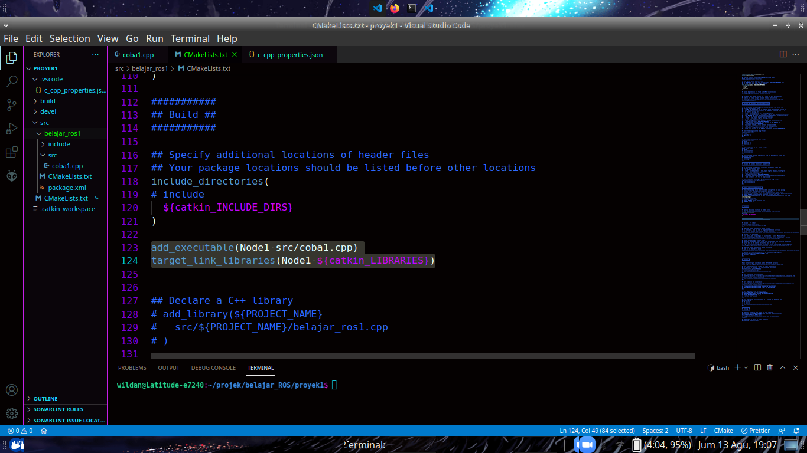
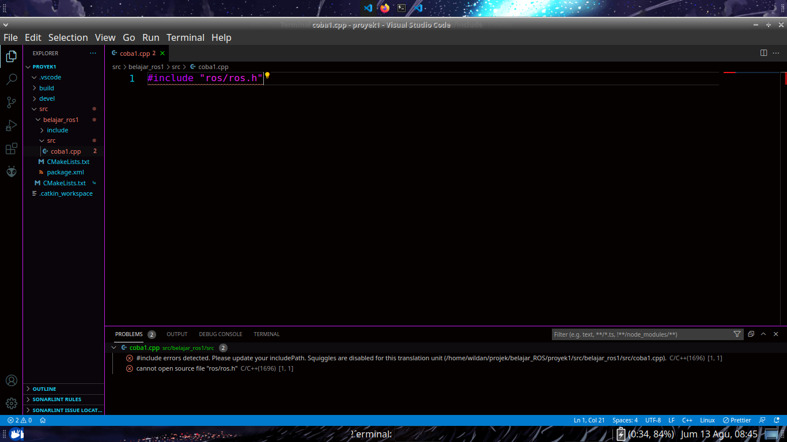

# Pengenalan Package, Node, Topic, dan cara kerja ROS.

## Cara kerja ROS

- Contoh package ini sebagai Alat gerak tubuh kita (Tangan dan Kaki)
- Contoh Node ini adalah (Tangan kanan, Tangan kiri, Kaki kanan, Kaki kiri, Otak)
- Topic ini seperti wadah, semisal mau mengirim apel dari Malang ke Surabay menggunakan Truck apel, maka Truck apel ini Topicnya, dan isinya adalah Apel. Topic disini digunakan sebagai pembungkus data yang akan ditransportasikan.
- Jadi semisal kita mau menggerakkan tangan kanan ke atas, maka Node Otak akan mengirim data berupa perintah untuk menggerakkan tangan kanan ke atas melalui topik **perintah otak ke tangan kenan**. Kemudian tangan kanan menerima perintah dari otak melalui topik **perintah otak ke tangan kenan**. Maka tangan kanan akan menjalankan perintah tersebut dan akan bergerak ke atas.

## Alat dan Bahan

1. ROS

## Pelaksanaan membuat Package

1. Buat direktori belajar ROS agar komputer anda terlihat rapi

```
mkdir Belajar_ROS
```

2. Masuk ke direktori tersebut

```
cd Belajar_ROS
```

3. Buat dan masuk direktori proyek

```
mkdir proyek1
cd proyek1
```

4. Membuat direktori src (Untuk kumpulan package yang anda buat)

```
mkdir src
```

5. Membuat catkin Package

```
catkin_create_pkg <package_name> [depend1] [depend2] [depend3]
```

Contoh

```
catkin_create_pkg belajar_ros1 std_msgs rospy roscpp
```

6. Kembali ke direktori proyek lalu build (compile) package

```
cd ../
catkin_make
ls
```

7. Jika sukses maka akan ada direktori bernama build dan devel. Lalu source setup proyek ke .bashrc

```
source devel/setup.bash
```

8. Buka direktori proyek dengan vscode

```
code .
```

## Pelaksanaan membuat Node dan Topic

1. Masuk ke direktori tempat kita menyimpan source code cpp

```
cd src/belajar_ros1/src
```

atau lewat global

```
cd ~/Belajar_ROS/proyek1/src/belajar_ros1/src
```

2. Buat sebuah file c++

```
touch coba1.cpp
```

3. Berikut adalah Source code untuk membuat Node dan Topik:

```
#include "ros/ros.h"
#include "std_msgs/Int16.h" //tipe data untuk data di dalam topik

int main(int argc, char **argv)
{
    ros::init(argc, argv, "Node1"); //ros::init(argc,argv,"nama_node") -> untuk membuat node
    ros::NodeHandle node_handler; //untuk meng-handle node
    node_handler.advertise<std_msgs::Int16>("Topik1", 1000); //advertise<tipe_data>("nama_topik",size) -> untuk membuat topik
    return 0;
}
```

4. Menyiapkan CMakeLists yang terletak di dalam direktori belajar_ros1

```
add_executable([nama_node] src/[nama_file])
target_link_libraries([nama_node] ${catkin_LIBRARIES})
```

Contoh

```
add_executable(Node1 src/coba1.cpp)
target_link_libraries(Node1 ${catkin_LIBRARIES})
```

Tambahkan 2 line diatas setelah 'include directories'. Sehingga menjadi:
  
5. Kembali ke direktori Proyek lalu build

```
cd ~/Belajar_ROS/proyek1/
catkin_make
```

6. Jika sudah 100% berarti package sukses di-build (tidak ada error)

## Debugging

- VSCode mengindikasikan error tapi sukses di-build? -> [Setup tambahan ROS](Setup_tambahan_ros.md)  
  

`*nb jika ada error, perhatikan lagi direktori-direktorinya`
