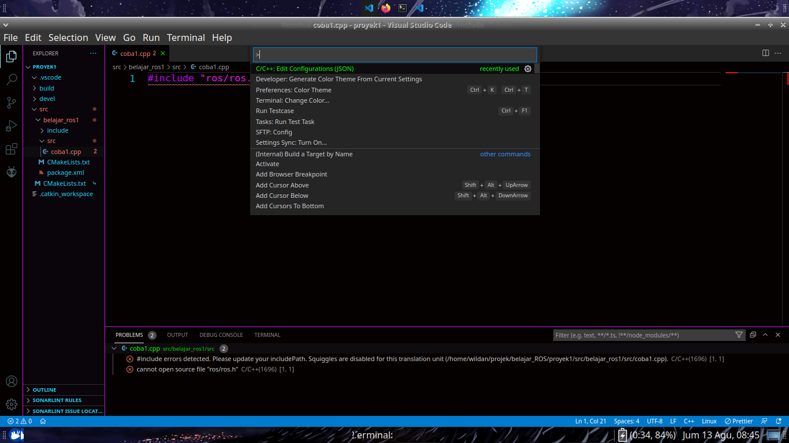
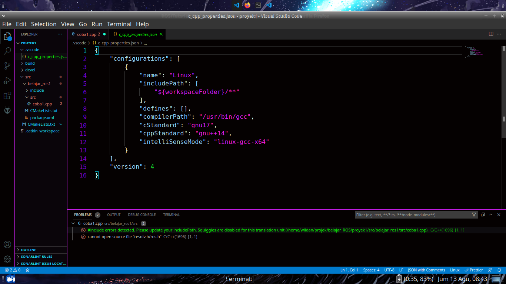
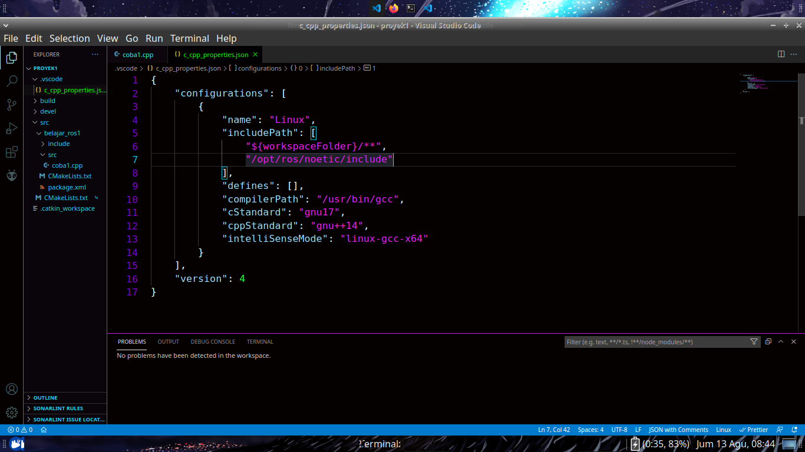

# Setup tambahan ROS untuk VSCode

## Pelakasanaan

1. Buka Command pallete `ctrl+shift+p`
2. Pilih `C/C++: Edit Configurations (JSON)`  
   
3. Buka file tersebut
   
4. Tambahkan `/opt/ros/noetic/include/` pada includePath
   

## Debugging

- Masih error? -> mungkin beda versi ROS, silahkan cari direktori include ROS lalu tambahkan ke includePath
