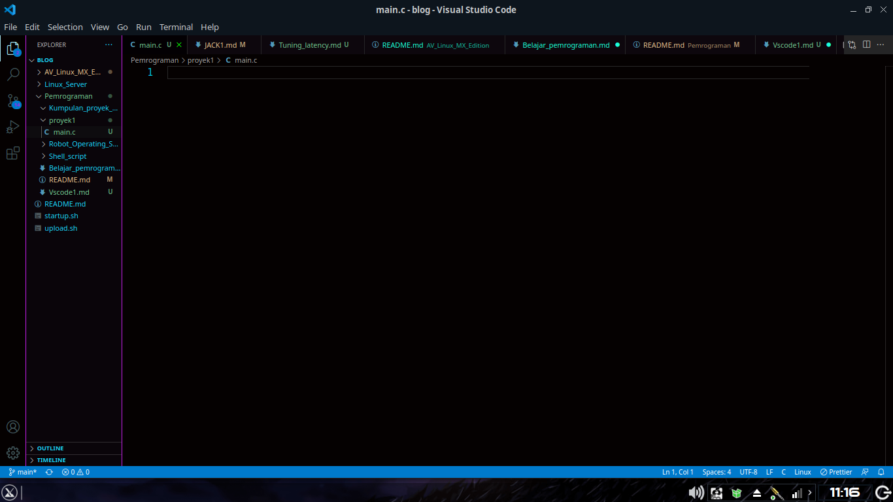
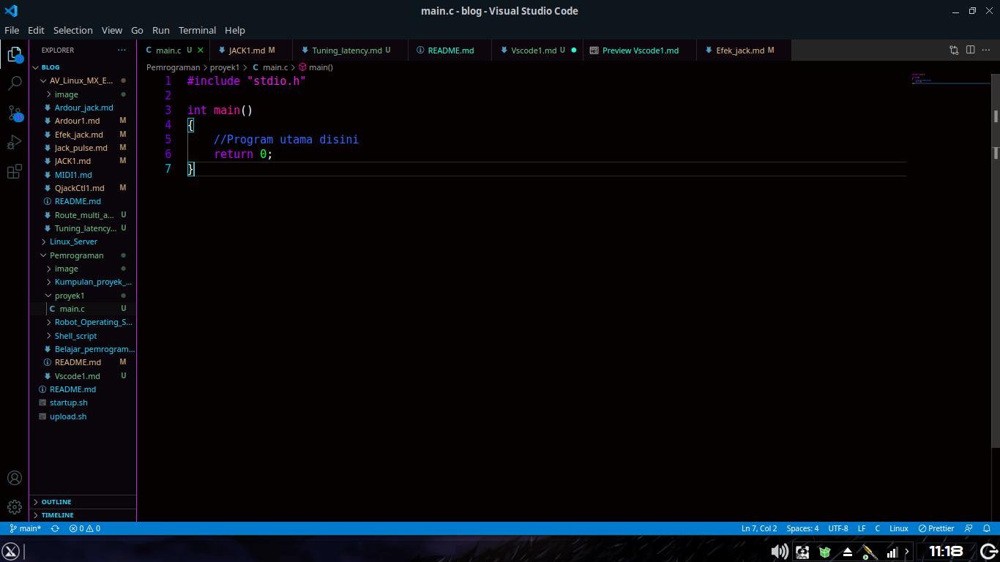
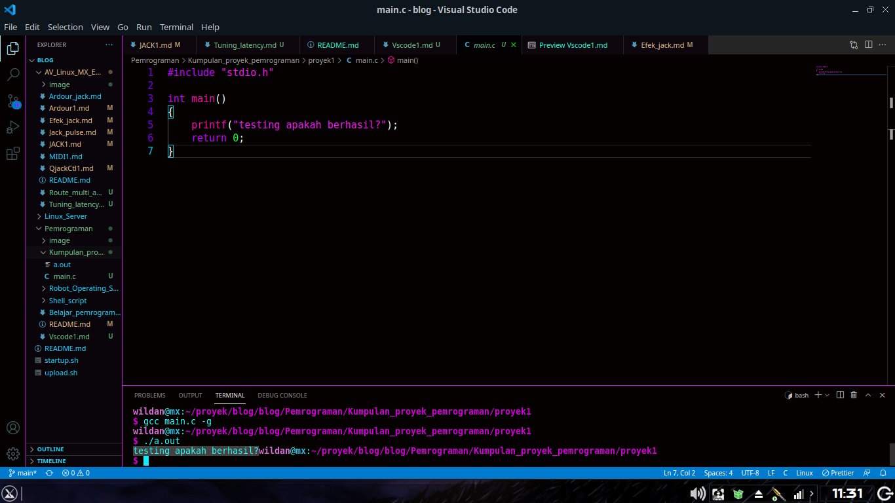

# Membuat proyek bahasa C

## Alat dan Bahan

1. VSCode
2. GCC
3. Terminal

## Pelaksanaan

1. Buat direktori (lewat terminal) untuk menyimpan kumpulan proyek dan masuk kedalamnya

```
mkdir Kumpulan_proyek_pemrograman
cd Kumpulan_proyek_pemrograman
```

2. Buat direktori proyek

```
mkdir proyek1
```

3. Buka VSCode dari terminal

```
code proyek1/.
```

atau

```
cd proyek1
code .
```

4. (Masih di terminal) buat file .c

```
touch proyek1/main.c
```

atau

```
touch main.c
```

5. Testing

## Testing

1. Buka main.c dari VSCode  
   
2. Struktur dasar untuk ngoding menggunakan bahasa C  
   
3. Coba untuk mengeluarkan sesuatu `printf()`

```
#include "stdio.h"

int main()
{
    printf("testing apakah berhasil?");
    return 0;
}
```

4. Lalu compile, buka terminal milik VSC -> `ctrl+backtick` atau bisa menggunakan terminal yang tadi (intinya berada di direktori yang sama)

```
gcc main.c -g
```

5. Setelah di-compile maka akan ada file bernama a.out (Linux) atau a.exe (windows). Lalu jalankan file tersebut

```
./a.out
```



## Debugging

- Gagal compile? -> cek apakah gcc telah terinstal atau tidak dengan `gcc -v`
- Gcc telah terinstal namun gagal? -> perhatikan lagi direktori terminalnya coba gunakan `ls | grep main.c`, jika tidak terdapat output maka direktori anda salah

## Kenapa CLI??

1. Karena agar saya mudah untuk menulis artikel ini :)
2. Karena lebih cepat mengetik daripada menggunakan Touchpad
3. Bisa Copy Paste command
4. Sangat berguna untuk konfigurasi komputer lebih dalam
